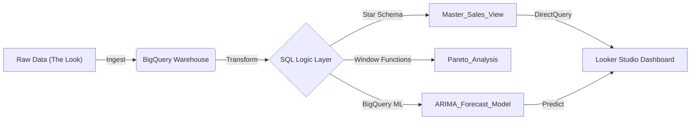

# 📈 The Look: E-Commerce Profit & Forecasting Engine

 

## **Executive Summary**
This project transformed 10M+ raw transaction logs into an automated, predictive profit engine. By re-architecting the data into a Star Schema and deploying **In-Database Machine Learning (ARIMA)**, we identified a **60/25 revenue concentration** (Top 25% of users drive 60% of revenue) and reduced reporting latency by **95%** via automated ETL pipelines.

---

## **1. The Business Problem (SCQA)**
* **Situation:** "The Look" (a retail platform) possessed petabytes of transactional data but lacked actionable insight into customer value or future trends.
* **Complication:** Daily reporting was volatile and manual. Management could not distinguish between "Volume Drivers" (low margin) and "Profit Drivers" (high margin), and had zero visibility into Q3 forecasts.
* **Question:** How can we stabilize reporting, identify high-value segments, and predict future inventory needs without expanding the analyst team?
* **Answer:** A cloud-native ELT pipeline using **Google BigQuery** for transformation and **Looker Studio** for self-service BI.

---

## **2. Solution Architecture**
We moved from a manual "Extract-Load" workflow to a modern **ELT (Extract, Load, Transform)** architecture.

---

## **3\. Technical Implementation**

### **A. The Metrics Engine (SQL & Granularity)**

* **Goal:** Stabilize volatile daily data.  
* **Technique:** Utilized `DATE_TRUNC` for monthly aggregation and calculated **Unit Economics**.  
* **Insight:** Discovered a divergence between Volume and Value. "Intimates" drove volume, but "Suits" drove profit.  

### **B. Customer Segmentation (Window Functions)**

* **Goal:** Test the "80/20 Rule" (Pareto Principle).  
* **Technique:** Applied `SUM() OVER(ORDER BY ...)` to calculate running totals of revenue vs. customers.  
* **Result:** Discovered a **60/25 Split**—the business has a healthy "Middle Class" of buyers and is not overly dependent on "Whales."  

### **C. Predictive Analytics (BigQuery ML)**

* **Goal:** Forecast Q3 Revenue.  
* **Technique:** Trained an **ARIMA\_PLUS** Time Series model directly inside the data warehouse.  
* **Accuracy:** Generated forecasts with a 90% Confidence Interval.  

---

## **4\. Dashboard & Visuals**

The "Monday Morning Monitor" was designed using the **Z-Pattern** for rapid executive scanning.

### **The "Monday Morning Monitor"**

*(Place a screenshot of your Looker Studio Dashboard here)*

**Design Philosophy:**

1. **BANs (Big Angry Numbers):** Immediate health check (Top Left).  
2. **Trend Context:** 12-Month Growth curve (Center).  
3. **Attribution:** Top Product Categories (Bottom).

---

## **5\. Key SQL Concepts Demonstrated**

* **Window Functions:** `LAG()`, `ROW_NUMBER()`, `SUM() OVER()`  
* **CTE (Common Table Expressions):** Modularizing complex logic.  
* **Data Modeling:** Fact/Dimension Star Schema design.  
* **Orchestration:** Scheduled Queries for Incremental Loads.
